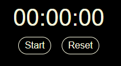
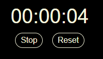

# Timer

This is a simple Timer built with HTML, CSS, and JavaScript.

Before you click Start  

While the timer runs, you can click "Stop" to pause the timer or "Reset" to resume.  

### Use as Notion widget

In order to use this timer as a widget in your Notion template, follow these steps:

1. Copy the URL https://konstantinacode.github.io/Timer/
2. In your Notion page, add a new /embed block.
3. Insert the URL into the dialog.
4. Click the "Embed link" button.

